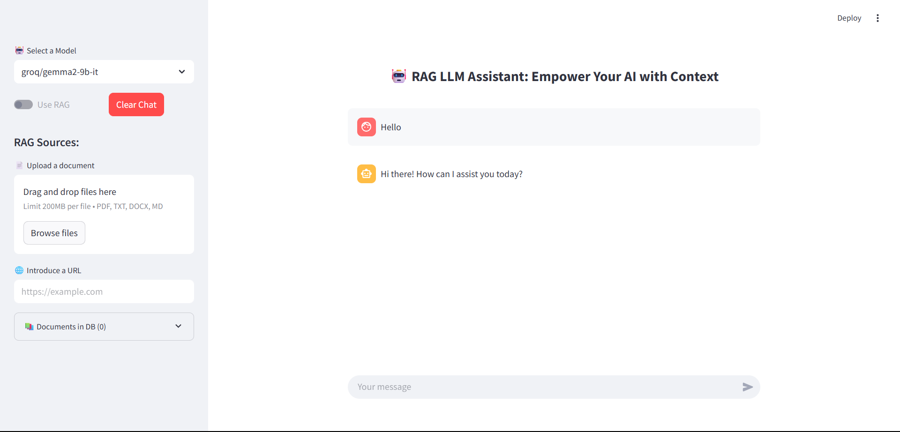

<p align="center">
  
</p>

<h1 align="center">IntelliDoc ChatPro 🤖📄</h1>

<div align="center">

  [](http://localhost:8501)
  [](https://www.python.org/)
  [](https://streamlit.io/)
  [](https://www.langchain.com/)
  [](https://huggingface.co/)
  [](https://groq.com/)
  [](https://opensource.org/licenses/MIT)

</div>

> 🧠 **AI-powered document question answering with persistent chat history**, built using Groq LLMs, HuggingFace Embeddings, and LangChain RAG — deployed via Streamlit for an intuitive UI.


---

## 🚀 Features

- 🧠 Groq LLM integration (Gemma, LLaMA3, Qwen, LLaMA-Guard)
- 🔍 Retrieval-Augmented Generation (RAG) with PDF, DOCX, TXT, MD, URLs
- 💬 Persistent Chat History using `st.session_state`
- 🧠 HuggingFace embedding + ChromaDB for document vector storage
- 📄 Upload limit: 10 documents or URLs
- 🧹 Clear chat and toggle RAG
- ⚙️ Streamlit UI – minimal, interactive

---

## 📸 UI Preview

<p align="center">
  
</p>

---

## 🛠️ Installation

```bash
git clone https://github.com/Electrolight123/intellidoc-chatpro.git
cd intellidoc-chatpro
python -m venv venv
source venv/bin/activate  # Windows: venv\Scripts\activate
pip install -r requirements.txt
```

---

## 🔑 Setup Environment Variables
Create a `.env` file in the root folder with:
```
GROQ_API_KEY="your_groq_api_key"
HUGGINGFACE_API_KEY="your_huggingface_api_key"
```

---

## ▶️ Run the App

```bash
streamlit run app.py
```
Open [http://localhost:8501](http://localhost:8501) in your browser.

---

## 🧠 Supported LLM Models

- groq/gemma2-9b-it
- groq/llama-guard-4-12b
- groq/llama-3.3-70b-versatile
- groq/qwen-qwq-32b

---

## 💾 Chat History

The app stores chat messages per session, enabling ongoing conversations without losing context.

---

## 📁 Project Structure

```bash
intellidoc-chatpro/
├── app.py
├── rag_methods.py
├── requirements.txt
├── .env
├── docs/
│   ├── test_rag.pdf
│   └── test_rag.docx
├── assets/
│   ├── banner.png
│   └── ui_mockup.png
├── README.md
```

---

## 🧪 Sample Docs for Testing

Sample files for testing the RAG engine are available in the [`docs/`](docs/) folder:
- `test_rag_sample.pdf`
- `test_rag_sample.docx`

---

## 📜 License

MIT License. See LICENSE for details.

---

## 🙋 Contribution & Contact

Pull requests welcome! For questions or feature requests, open an issue or contact me at [Abhishekbala089@gmail.com].

---

## ⭐ Show Your Support

If you find this helpful, please ⭐ star the repo and share it!
